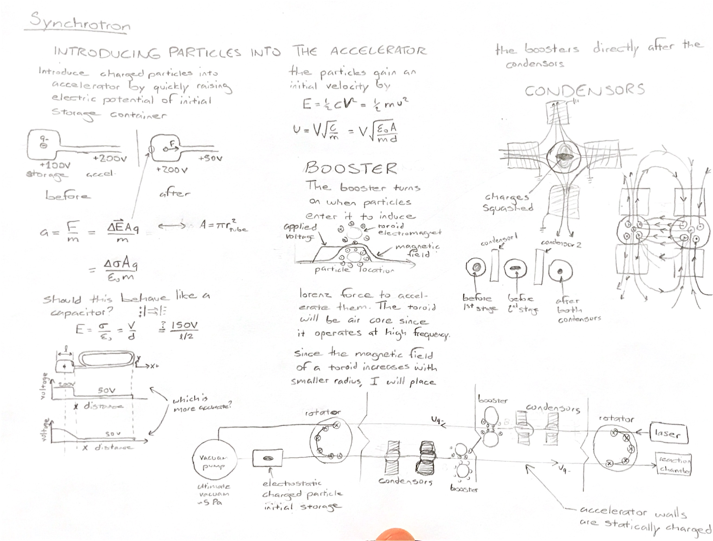

# particle-accelerator

Thank you for taking the time to review my work. I sincerely appreciate this and will invite you to be a co-author on any paper that comes from this research. My goal with this project is to design, construct, and test a synchrotron particle accelerator with statically charged particulates

## Motivation

- test my own understanding of physics especially electromagnetism
- collaborate with my younger brother on a project

## Background

A quick google search of ["do it yourself nuclear fusion"](https://www.google.com/search?q=do+it+yourself+nuclear+reactor&oq=do+it+yourself+nuclear) quickly yielded many personal experiences of building electrostatically confined dueterium fusion reactors or "fusors" including a step-by-step [Instructables article](https://www.instructables.com/id/Build-A-Fusion-Reactor/). I was quickly excited and began [planning my own fusion reactor](fusor.md) and purchasing components. After two days of deleria, I woke up and contemplated how dangerous 100kV could be, so I canceled those plans and began investigating other learning exercises that also involved (somewhat) high energy physics.

The sychrotron seems most appealing to me because its closed path can take advantage of progressive acceleration. This means magnetic or electrostatic acceleration fields to be maintained at safer voltages.

## Design

### First sketches

## Practical Considerations

- will the accelerator tube's electrostatic charge be enough to prevent wall collisions?
- will the vacuam be high enough to make drag insignificant?
- will the circuitry be able to switch faster enough at maximum speed?
- will the turning solenoids saturate?
- is the influence of gravity so significant that I shoud make the charge density of the accelerator tube assymetric?
